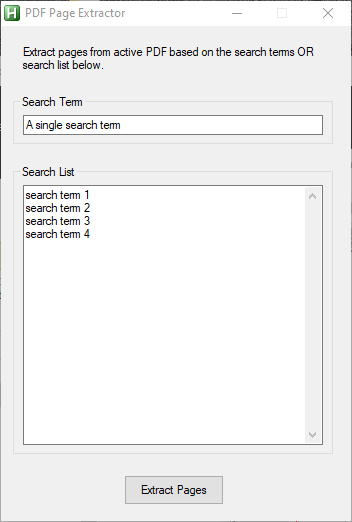

# Examples-of-Technical-Skills
This repository was created to hold code examples that demonstrate the use of my skills

<h2>PDF Page Extractor (AutoHotkey)</h2>
<h3>Example of Adobe's Interapplication Communication API</h3>

#See Code Here!](Adobe%20Extract%20Pages%20Based%20on%20Text.ahk)
 
Extract pages that include a single search term OR a list of search terms.  If they appear in one of the PDF pages, then that page will be extracted into a new PDF document!  This functionality is not available in Adobe Acrobat Pro.  Program references the active PDF file for simplicity and ease of use.
 
 

<h2>Adobe Text Extraction (AutoHotkey)</h2>
<h3>Extract data from a PDF fillable form</h3>
This program is form and usage specific, however it displays the ability to extract text from a pdf form and then transforming the data into a desired format.  In this case, we pull data from the PDF form and format it to be easily pasted into an online shopping cart.  Tedious data entry avoided!
 
 
<h2>Outlook Automation (VBA)</h2>
<h3>Extract attachments from emails and send them to a folder!</h3>
This program is usage specific, however it displays the ability to extract email attachments.  It references the default Outlook email inbox and iterates all messages.  If a PDF file exists, then it saves that file to an output folder!  Using the other tools above we can extract the text and analyse the data!

